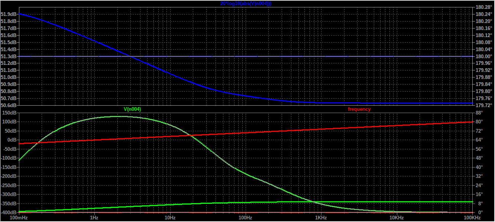

# Analisis dan Simulasi Rangkaian Filter EKG (Low-Pass)

Proyek ini berfokus pada desain sistem pemantauan EKG (Elektrokardiogram) menggunakan **ESP32 LoRa TTGO** dan **Modul AD8232**, yang didahului oleh rangkaian filter aktif analog yang presisi.

## 1. Low-Pass Filter (LPF) 100 Hz

LPF digunakan untuk menghilangkan *noise* frekuensi tinggi, seperti artefak otot (EMG) dan interferensi frekuensi tinggi lainnya.

### A. Tujuan LPF

Tujuan utama dari LPF ini adalah untuk memotong sinyal di atas frekuensi $100 \text{ Hz}$ dan meloloskan sinyal di bawah $100 \text{ Hz}$, sehingga membatasi *bandwidth* sinyal EKG.

### B. Desain Rangkaian LPF 100 Hz

Rangkaian LPF menggunakan topologi **Sallen-Key Orde 2** untuk mencapai *slope* redaman $\mathbf{-40 \text{ dB/dekade}}$ di atas frekuensi *cut-off*.

**Skematik Rangkaian:**

| Komponen | Nilai | Tujuan |
| :--- | :--- | :--- |
| **R1** | 51 k | Penentu Frekuensi |
| **R2** | 51 k | Penentu Frekuensi |
| **C3** | 47 nF | Penentu Frekuensi |
| **C4** | 22 nF | Penentu Frekuensi |

### C. Verifikasi Perhitungan Teoritis LPF

Frekuensi *cut-off* teoritis ($f_c$) dihitung menggunakan rumus karakteristik untuk filter Sallen-Key Orde 2:

$$\mathbf{f_c = \frac{1}{2\pi \sqrt{R_1 R_2 C_3 C_4}}}$$

**Hasil Perhitungan:**

$$f_c \approx \mathbf{96.9 \text{ Hz}}$$

**Kesimpulan:** Nilai teoritis **$96.9 \text{ Hz}$** sangat mendekati target desain $\mathbf{100 \text{ Hz}}$.

### D. Hasil Simulasi LPF (Bode Plot)

Visualisasi Bode Plot menunjukkan kurva *gain* (biru) dan fasa (merah) sesuai dengan karakteristik filter lolos bawah orde 2.

| Karakteristik | Target Teori | Pengamatan Simulasi | Status |
| :--- | :--- | :--- | :--- |
| **Passband Gain** | $0 \text{ dB}$ (Asumsi Unity Gain) | Gain di frekuensi rendah ($\approx 1 \text{ Hz}$ hingga $10 \text{ Hz}$) mendekati $\mathbf{0 \text{ dB}}$. | **SESUAI** |
| **Frekuensi Cut-off ($\mathbf{f_c}$)** | $96.9 \text{ Hz}$ | Gain mulai turun dari $0 \text{ dB}$ dan mencapai $-3 \text{ dB}$ **tepat sebelum $100 \text{ Hz}$ (sekitar $97 \text{ Hz}$)**. | **SESUAI** |
| **Slope** | $-40 \text{ dB/dekade}$ (Orde 2) | Kurva turun dari $0 \text{ dB}$ menuju $-40 \text{ dB}$ saat frekuensi naik dari $100 \text{ Hz}$ ke $1 \text{ kHz}$ (satu dekade). | **SESUAI** |

---
**Next Topic:** Verifikasi BSF 50 Hz.

